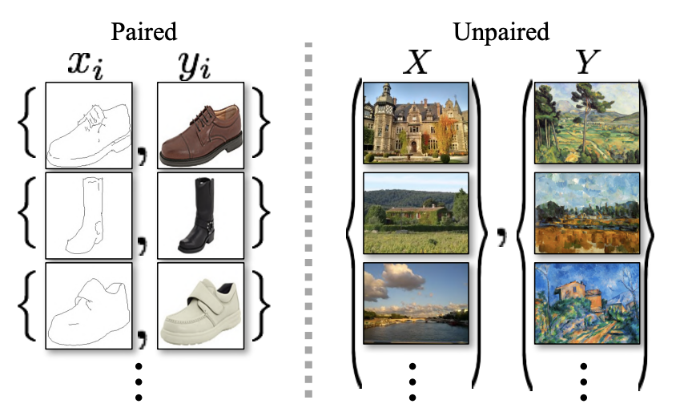
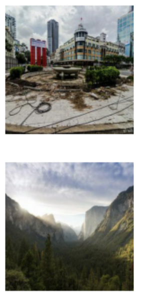
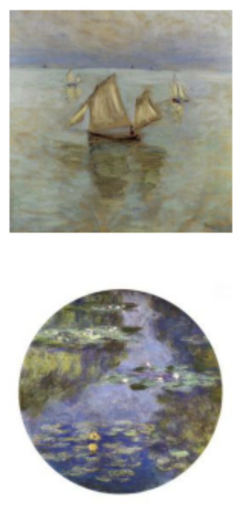
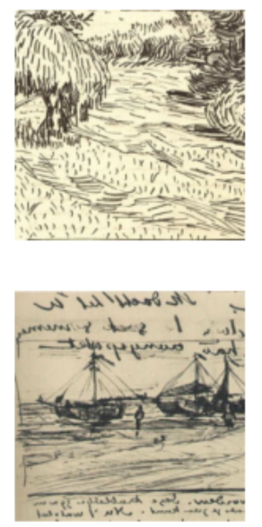
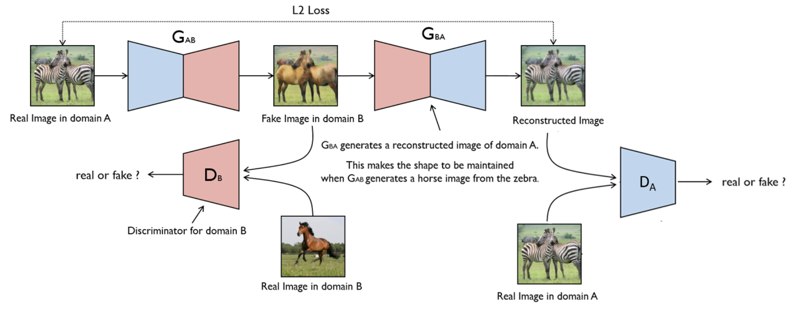
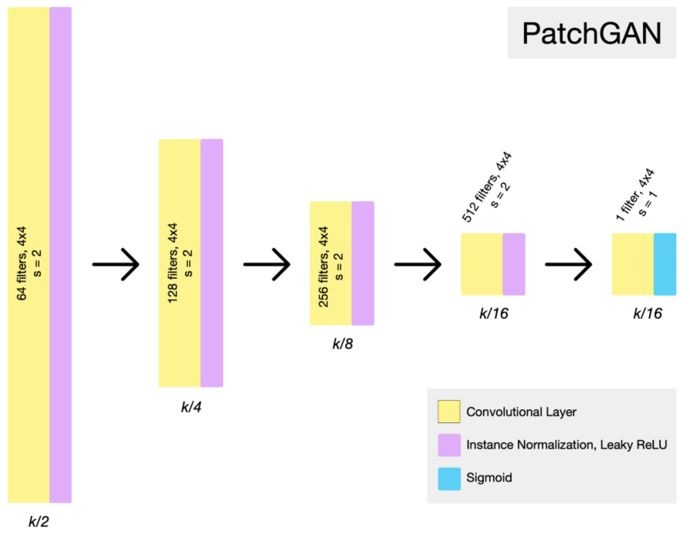
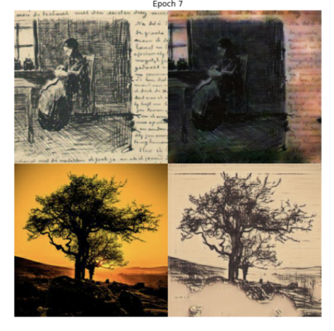

## Abstract 

- in a paragraph or two, summarize the project

The greatest painters left amazing art works to us, and we are still admiring their art and style until today. It would 
amazing if we can replicate the same style from them. And you can easily turn any photography you like into the same 
Monet or Van Gogh yourself. 

This Project is a learning and experimentation of the Cycle GAN from the paper <em>Unpaired Image-to-Image Translation 
using Cycle-Consistent Adversarial Networks</em> . In this project I trained a Clycle GAN model by following the methods 
described in the original paper. The data I'm using to tain includes photot of real life views, Monet's paintings, Van 
Gogh's paintings(sketches). The example training images were very close to real life looking paintings, so i also trained a
network using sketches from Van Gogh's paintings. 

<figcaption align = "center"> Cycle GAN result image from <em>Unpaired Image-to-Image Translation using Cycle-Consistent Adversarial 
Networks</em> </figcaption>

## Problem statement 

In training image to a different style, I would be much easier to used paired photo and paintings for training, 

But in most cases, we don't have such ability to paired data. 

The problem statement is how can we generate image with certain styles without having a good amout of paired data. 

For example, if we want to transform a real life photography to a Van Gogh styled painting, we will not be able to get 
a real life photography matching Van Gogh styled painting.

    

<figcaption align = "center"> Example paired/unpaired image from <em>Unpaired Image-to-Image Translation using Cycle-Consistent Adversarial 
Networks</em> </figcaption>

## Related work 

### Paper

Unpaired Image-to-Image Translation using Cycle-Consistent Adversarial Networks
https://arxiv.org/pdf/1703.10593.pdf

### Data

1. Photography

https://www.kaggle.com/c/gan-getting-started

2. Monet Paintings

https://www.kaggle.com/c/gan-getting-started

3. Van Gogh Paintings

https://www.kaggle.com/ipythonx/van-gogh-paintings

### Package 
Unpaired image-to-image translation

https://github.com/tmabraham/UPIT

### Kaggle
I’m Something of a Painter Myself

https://www.kaggle.com/c/gan-getting-started

https://www.kaggle.com/dimitreoliveira/improving-cyclegan-monet-paintings

### Methodology

In this case, we are transofmring data from domain x (photos) to domain y(stylished paintings). 
first, we need a distriminator to jude if the generated image belongs to domain y. 

using only the discriminator may cause problems like generating images that look like it's a image in domain y, but the generated image may turned out to have nothing in relation with the input image. 

so to avid problem like this, another generater is needed to transform the image from domain y back to image in domain x. 

and we need to make the regenerated input image to be as close as to the original input image. 

so we need another cycle gan that do the reverse work. 

To try on a more dramatic and different style from the , I also tried the skechtings from van gogh's paintings. 

there are two generator and two discriminator.

In the paper <em>Unpaired Image-to-Image Translation 
using Cycle-Consistent Adversarial Networks</em> the authors succeeded in training the cycled GAN to generate various 
art styled paintings.

    

### Discriminator

    

the disciminator is made up of 

### Generator

Here is the ResNet-block-based architecture of the generator. 
With 3 convolutional layers of encoder, 6 layers of residual block, and 3 convolutional layers of decoder. 

    

## Experiments/evaluation 

- how are you evaluating your results

## Examples

- images/text/live demo, anything to show off your work

### Results

The model I implemented and trained is successful in making monet styled painting from real life photography. So 

And as a result, it takes way to long and GPU consuming a train the GAN model

After training 120 epoches with the Monet paintings data set and 13 epoches with Van Gogh's sheckes, my chrome/computer
finally crashed. 

#### Monet:

#### Van Gogh sketches:

painting -> photo

    

painting -> photo

I would say it is looking pretty successful in generating the paintings and photos.

## Video

@Misc{UPIT,
    author =       {Tanishq Mathew Abraham},
    title =        {UPIT - A fastai/PyTorch package for unpaired image-to-image translation.},
    howpublished = {Github},
    year =         {2021},
    url =          {https://github.com/tmabraham/UPIT}
}
