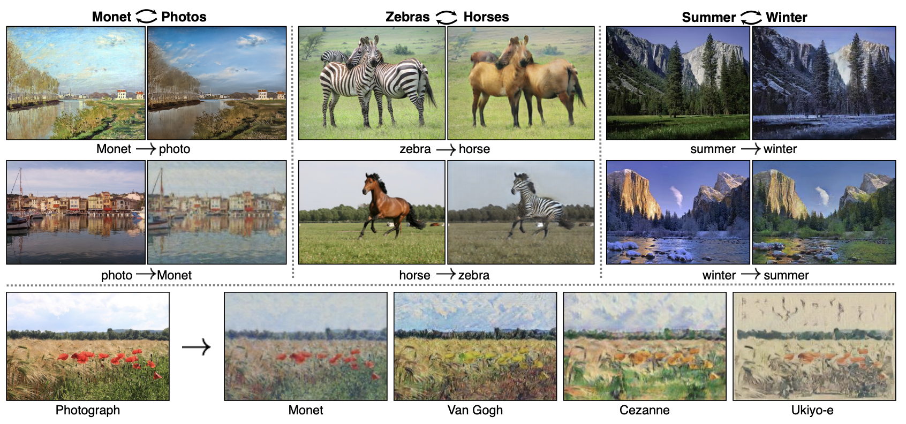
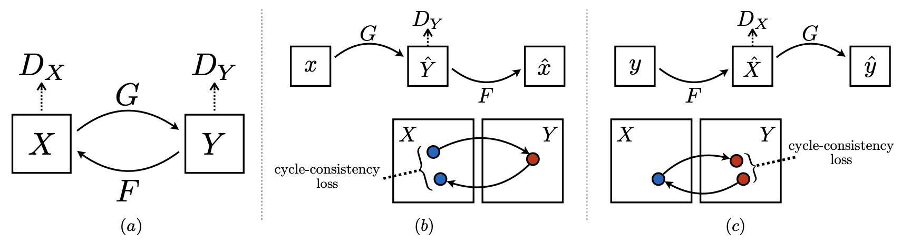

## Abstract 

- in a paragraph or two, summarize the project

This Project is an learn, experimentation, and reproduce of the image to image translation published in the paper
using the Cycle GAN from the paper <em>Unpaired Image-to-Image Translation using Cycle-Consistent Adversarial 
Networks</em> . 

In this project....

Train a Clycle GAN model, input photographies, output Monet Style Paintings. 

The project is to produce perform image to image transformatioin, intended in creating Monet styled paintings by training generative adversarial networks. 

The greatest painters left amazing art works to us, and we are still admiring their art and style until today. 

It would amazing if we can replicate the same style from them. 

And you can easily turn any photographies you like into the same Monet or Van Gogh yourself. 

## Problem statement 

- what are you trying to solve/do

In training image to a different style, usually needs paired data for training, 

but in some cases, we dont have paired data. 

The problem statement is how can we generatae image without having paired data. 
for example, if we want to transforem a real life photograohy to a van goph styled painting, we can get eal life photograohy to a van goph styled painting, but these images can not be paired.  

## Related work 

- what papers/ideas inspired you 
- what datasets did you use, etc

### Paper

Unpaired Image-to-Image Translation using Cycle-Consistent Adversarial Networks
https://arxiv.org/pdf/1703.10593.pdf

### Data

1. Photography

https://www.kaggle.com/c/gan-getting-started

2. Monet Paintings

https://www.kaggle.com/c/gan-getting-started

3. Van Gogh Paintings

https://www.kaggle.com/ipythonx/van-gogh-paintings

### Methodology

in the paper for cycle GAN, the authors are able to transform horse to zebra, and transform zebra back to horse, or transform the real life photographies to a certain art style.

in this case, we are transofmring data from domain x to domain y. 
and we need a distriminator to jude if the generated image belongs to domain y. 

using only the discriminator may cause problems like generating images that look like it's a image in domain y, but the generated image may turned out to have nothing in relation with the input image. 

so to avid problem like this 

we need another generate to transform the image from domain y back to image in domain x. 

and we need to make the regenerated input image to be as close as to the original input image. 

so we need another cycle gan that do the reverse work. 

To try on a more dramatic and different style from the , I also tried the skechtings from van gogh's paintings. 

there are two generator and two discriminator.

### Discriminator

the disciminator is made up of 

### Generator

the generator is ...

## Results 

- How well did you do

The model is successful in making monet styled painting from real life photographies.

## Experiments/evaluation 

- how are you evaluating your results

## Examples

- images/text/live demo, anything to show off your work

### Notebook

### Results
input image:

output image:

## Video

