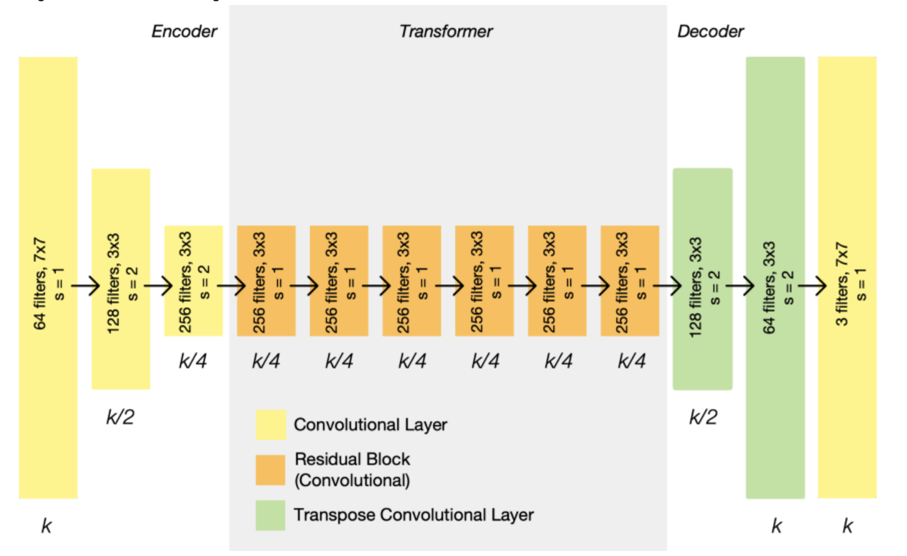
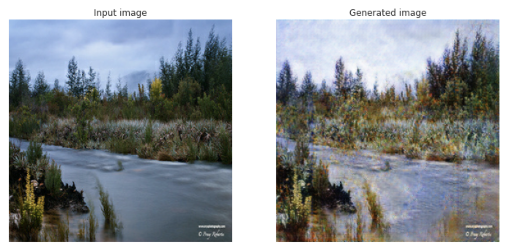
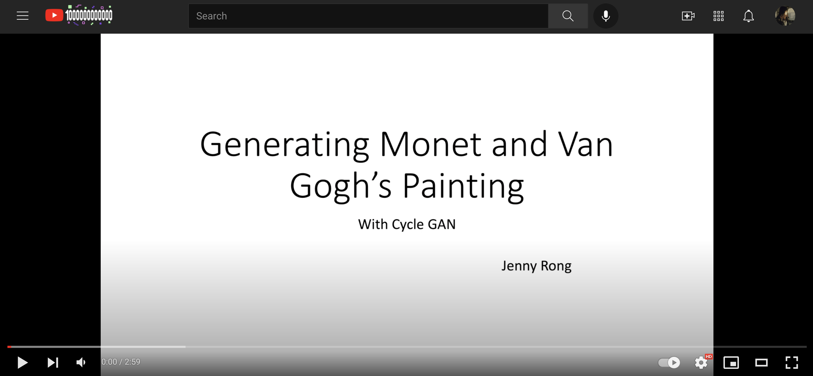

## Abstract 

The greatest painters have left priceless artworks to us, and we are still admiring their art and style until today. It would be
amazing if we can replicate the same style from them. And in this way, anyone may be able to turn any photography you like into the same 
Monet or Van Gogh's style. 

This Project is a learning and experimentation of the Cycle GAN from the paper <em> Unpaired image-to-image Translation 
using Cycle-Consistent Adversarial Networks </em>  . In this project, I trained a Cycle GAN model by following the methods 
described in the original paper. The data I'm using to train includes photos of real-life views, Monet's paintings, Van 
Gogh's paintings(sketches). And since I noticed the example training images were very close to real-life-looking paintings, so I also trained a
network using sketches from Van Gogh's paintings. As a result, both trainings are very successful. 

<figcaption align = "center"> Cycle GAN result image from <em>Unpaired Image-to-Image Translation using Cycle-Consistent Adversarial 
Networks</em> </figcaption>

## Problem statement 

In training image to a different style, it would be much easier to used paired photos and paintings for training. 
But in most cases, we don't have such ability to get well paired data. The problem statement is how can we generate image with 
certain styles without having a good amount of paired data. For example, if we want to transform a real life photography to a Van Gogh styled painting, we will not be able to get 
a real life photography matching Van Gogh styled painting.

    

<figcaption align = "center"> Example paired/unpaired image from <em>Unpaired Image-to-Image Translation using Cycle-Consistent Adversarial 
Networks</em> </figcaption>

## Related work 

### Paper

Unpaired Image-to-Image Translation using Cycle-Consistent Adversarial Networks
https://arxiv.org/pdf/1703.10593.pdf

### Data

1. Photography

https://www.kaggle.com/c/gan-getting-started

2. Monet Paintings

https://www.kaggle.com/c/gan-getting-started

3. Van Gogh Paintings

https://www.kaggle.com/ipythonx/van-gogh-paintings

### Package 
Unpaired image-to-image translation

https://github.com/tmabraham/UPIT

### Kaggle
I’m Something of a Painter Myself

https://www.kaggle.com/c/gan-getting-started

https://www.kaggle.com/dimitreoliveira/improving-cyclegan-monet-paintings

## Methodology

To generate images in a certain style, we are transforming data from domain X (photos) to domain Y (styled paintings). 

First, we need a discriminator to judge if the generated image belongs to domain Y. 

But using only the discriminator may cause problems like generating images that look like it's an image in domain Y, 
but the generated image may turn out to have nothing in relation to the input image. 

So to avoid problems like this, another generator is needed to transform the image from domain Y back to image in 
domain X, we need to make the regenerated input image to be as close as to the original input image. aka minimizing the loss. 

We also need another generator and discriminator to use the painting to regenerate the image back in domain X and minimize the 
loss of the regenerated painting to the original painting. 

And as I noticed that the dataset presented in the original paper are using data/images that are close to the realistic 
style. Thus I also tried training on a more dramatic and different style of data, I also tried the pencil sketches from Van Gogh's 
paintings dataset.

    

<figcaption align = "center"> Graphic representation of the Model. </figcaption>

### Discriminator

    

After the last layer, a convolution is applied to map to
a 1-dimensional output, followed by a Sigmoid function.

### Generator

Here is the ResNet-block-based architecture of the generator. 
With 3 convolutional layers of encoder, 6 layers of residual block, and 3 convolutional layers of decoder. 

    

## Experiments/evaluation 

As mentioned before, we need to minimize the loss from the input image to the regenerated， generating painting image, 
as well as the reverse, we need to minimize the loss from the generated painting from the regenerated painting generated photo. 

For evaluating, looking at the example generated images, they are looking very close to the Monet and Van Gogh's painting
Style.

## Examples

Some example images and paintings generated with the trained model. 

### Monet:

photo -> painting

    

### Van Gogh sketches:

painting -> photo

    

photo -> painting

## Results

The model I implemented and trained is successful in making Monet styled paintings and Van Gogh styled sketches from 
real-life photography.

As a result, it takes way too long and GPU consuming a train the GAN model, and after training 120 epochs with the Monet paintings data set and 13 epochs with Van Gogh's sketches, my chrome/computer
finally crashed.

I would say it is pretty successful in generating the paintings and photos to the styles I want.

## Video

### References

@Misc{UPIT,
    author =       {Tanishq Mathew Abraham},
    title =        {UPIT - A fastai/PyTorch package for unpaired image-to-image translation.},
    howpublished = {Github},
    year =         {2021},
    url =          {https://github.com/tmabraham/UPIT}
}
